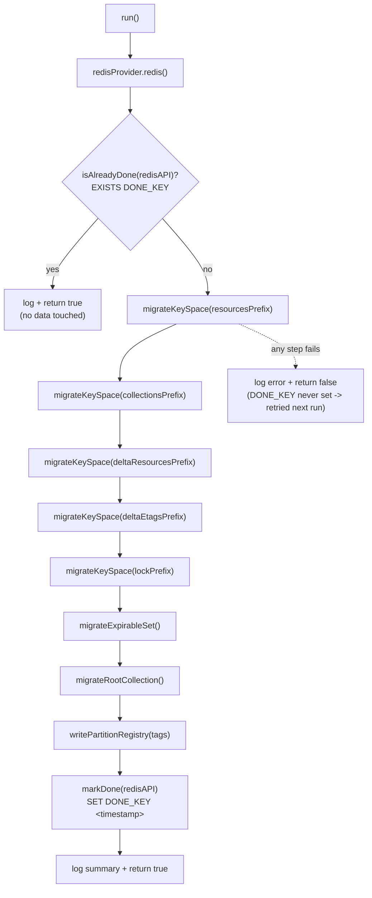
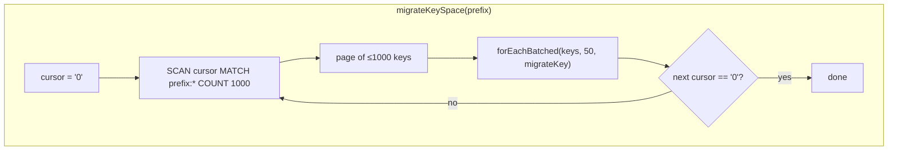
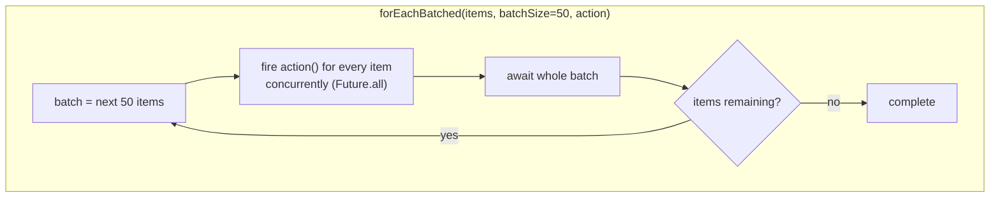
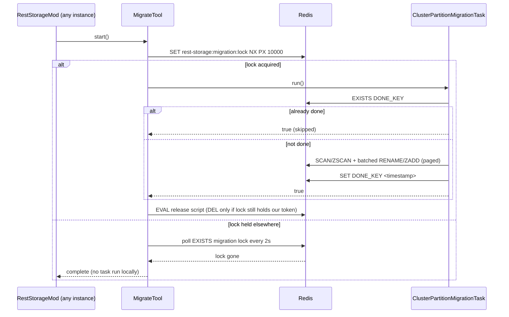

# `ClusterPartitionMigrationTask`

Technical reference for `org.swisspush.reststorage.migration.tasks.ClusterPartitionMigrationTask`, the
[`Task`](../src/main/java/org/swisspush/reststorage/migration/tasks/Task.java) that rewrites an existing
rest-storage keyspace from the plain (non-cluster) key layout to the Redis Cluster hash-tagged layout
used when `redisClusterPartitioningEnabled` is `true`.

For the end-user migration guide (how to run it, prerequisites, rollback), see [MIGRATION.md](../MIGRATION.md).
This document focuses on how the task itself is built.

## Key layout it rewrites

| Key | Before | After |
|---|---|---|
| resource | `rest-storage:resources:project:a` | `rest-storage:resources:{project}:a` |
| collection | `rest-storage:collections:project:a` | `rest-storage:collections:{project}:a` |
| lock | `rest-storage:locks:project:a` | `rest-storage:locks:{project}:a` |
| delta | `delta:resources:project:a` | `delta:resources:{project}:a` |
| expirable | one global ZSET `rest-storage:expirable` | one ZSET per partition `rest-storage:expirable:{project}`, members rewritten |
| root collection | ZSET `rest-storage:collections` | *deleted*; its members seed the partition registry |
| partition registry | &mdash; | SET `rest-storage:locks-partitions` |

Keys are moved with server-side `RENAME` (atomic, binary-safe, TTL-preserving) - this is why the task
must run against **pre-cluster** Redis (standalone/Sentinel); running it against a live Redis Cluster
that still holds untagged keys fails with `CROSSSLOT`.

## `run()` control flow

**Completion flag (`DONE_KEY`):** `rest-storage:migration:tasks:cluster-partition-migration:done`. It is
checked/set entirely inside this task (not in `MigrateTool`, which stays task-agnostic). Once set, it is
permanent (no TTL) - subsequent `run()` calls (e.g. after an app restart with the cluster flag still
`true`) short-circuit immediately without touching data. A failed run never sets it, so it is retried.

## Page-by-page scanning and batching

Both key-space renaming and expirable-set redistribution avoid loading the whole data set into memory:
they page through Redis via `SCAN`/`ZSCAN` (`SCAN_COUNT = 1000` items/page), and within each page fire up
to `BATCH_SIZE = 50` operations (`RENAME`/`ZADD`) concurrently before moving to the next batch.

This bounds both memory usage and in-flight Redis commands to a small, constant window regardless of
how large the migrated data set is. Renaming interleaved with an ongoing `SCAN` is safe: a rename only
changes the (still matching) prefix, and `migrateKey`/`migrateExpirableEntry` are idempotent, so a
renamed item resurfacing later in the same scan (per `SCAN`'s at-least-once guarantee) is a no-op
(counted as `skipped`, not `renamed`).

## Coordination with `MigrateTool`

Only one instance ever executes the task body at a time; every other instance polls the lock and
proceeds once it's released. The lock's TTL is refreshed every 2s for as long as the task runs, via a
compare-and-swap that only extends the TTL while the lock still holds this instance's own token - see
[MigrateTool.md](MigrateTool.md#key-layout) for the full ownership-token rationale and what happens if a
long stall causes ownership to be lost mid-run (the migration result is then treated as untrustworthy
rather than silently reported as successful).

## See also

- [MIGRATION.md](../MIGRATION.md) - operational guide (prerequisites, quick start, troubleshooting, rollback)
- [`ClusterPartitionMigrationTask.java`](../src/main/java/org/swisspush/reststorage/migration/tasks/ClusterPartitionMigrationTask.java)
- [`MigrateTool.java`](../src/main/java/org/swisspush/reststorage/migration/MigrateTool.java)
- [`ClusterPartitionMigrationTaskTest.java`](../src/test/java/org/swisspush/reststorage/migration/tasks/ClusterPartitionMigrationTaskTest.java)
