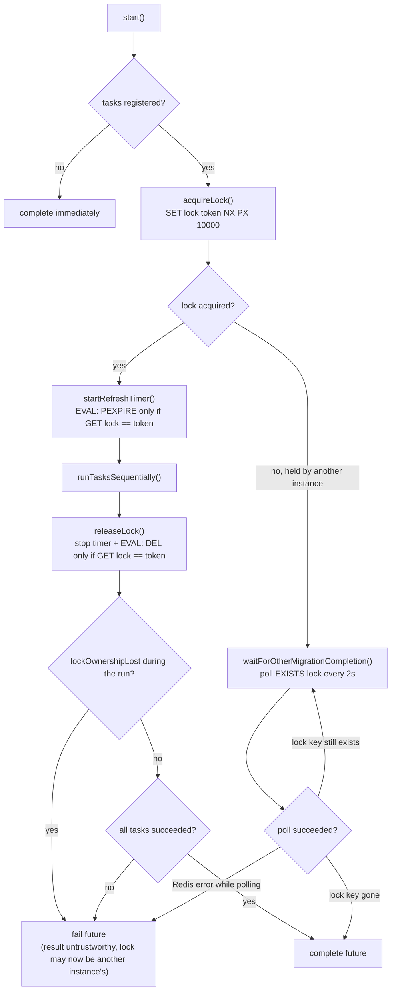
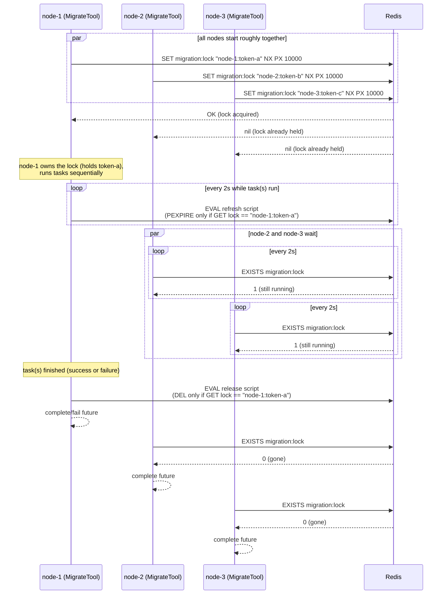

# MigrateTool

`MigrateTool` ([source](../src/main/java/org/swisspush/reststorage/migration/MigrateTool.java)) is a
generic, task-agnostic coordinator that ensures a set of registered [`Task`](../src/main/java/org/swisspush/reststorage/migration/tasks/Task.java)s
(e.g. [`ClusterPartitionMigrationTask`](ClusterPartitionMigrationTask.MD)) runs **exactly once at a time**
across all application instances that share the same Redis, using a distributed lock.

It knows nothing about what a task actually does - it only handles:
- mutual exclusion (a single distributed lock in Redis),
- keeping the lock alive for the duration of a long-running migration,
- letting every other instance wait for the in-progress migration to finish,
- running the registered tasks sequentially, stopping at the first failure.

## Key layout

| Key                             | Purpose                                     | TTL                                    |
|----------------------------------|----------------------------------------------|-----------------------------------------|
| `rest-storage:migration:lock`   | Distributed lock, value is a random per-acquisition token (`instanceId:UUID`) | 10s, refreshed every 2s while held |

**Lock safety (ownership token):** the lock's value is not just an identifier for logging - it is a
compare-and-swap token. Both the periodic TTL refresh and the final release run a small Lua script that
only mutates the lock (`PEXPIRE`/`DEL`) if it still holds *this instance's* token, instead of doing so
unconditionally. This matters because a long GC pause (or any other stall) can let the lock's TTL expire
while an instance still believes it holds it; without the token check, that stalled instance could later
refresh or delete a *different* instance's now-legitimately-held lock, breaking mutual exclusion. If a
refresh ever finds the token no longer matches, the instance stops refreshing immediately and treats its
own migration result as untrustworthy (`start()`'s future fails even if the task chain itself reported
success) - see [`MigrateTool.java`](../src/main/java/org/swisspush/reststorage/migration/MigrateTool.java)'s
class Javadoc for the full rationale.

Per-task "done" flags (if a task implements one, like `ClusterPartitionMigrationTask` does) are a
separate concern owned by the task itself - see [ClusterPartitionMigrationTask.MD](ClusterPartitionMigrationTask.MD#completion-flag).

## `start()` control flow

## Multi-node example (3 nodes)

Assume 3 application instances (`node-1`, `node-2`, `node-3`) start up at roughly the same time,
all with `redisClusterPartitioningEnabled=true`, all sharing the same Redis. Each instance builds
its own `MigrateTool` (with a unique `instanceId`) and registers the same tasks (e.g. one
`ClusterPartitionMigrationTask`), then calls `start()` during boot.

Notes on this example:

- **Only `node-1` runs the actual migration work.** `node-2` and `node-3` never execute the task's
  logic themselves in this run - they just wait for the lock to disappear and then continue their
  own startup, assuming the migration is now done (or was already done, see below).
- **Which node wins the race is non-deterministic.** Whichever `SET ... NX` reaches Redis first
  wins; it depends purely on network/scheduling timing, not on instance identity or start order.
- **The lock is refreshed, not fixed-TTL, and ownership is verified on every refresh/release.**
  Because `ClusterPartitionMigrationTask` can take a long time on large data sets, `node-1` refreshes
  the lock's TTL every 2 seconds - but only if the lock still holds `node-1`'s own token (see
  "Lock safety" above). If `node-1` stalls long enough for the TTL to expire and another node takes
  over the lock in the meantime, `node-1`'s subsequent refresh/release calls are no-ops against that
  other node's lock, and `node-1`'s own `start()` future fails (result no longer trustworthy) instead
  of silently corrupting the new owner's lock. If `node-1` crashes outright without releasing the
  lock, the lock still expires after at most 10 seconds (one missed refresh cycle), so the other
  nodes are never blocked forever.
- **Waiting nodes don't verify success, but do surface their own connectivity failures.**
  `waitForOtherMigrationCompletion()` only checks that the lock key is gone; it does not know or check
  whether `node-1`'s migration actually succeeded - if `node-1`'s task fails, `node-1`'s own `start()`
  future fails, but `node-2`/`node-3` still see an absent lock and complete normally. This is
  intentional: `MigrateTool` does not implement retry or failure propagation across nodes - each
  node's own logs are the source of truth for whether its local `start()` call failed. If, however, a
  waiting node itself loses its Redis connection while polling, that node's own `start()` future fails
  too (a poll failure is never mistaken for "migration complete").
- **Idempotent tasks matter.** Because a crash of `node-1` mid-migration releases the lock only via
  TTL expiry (not a clean release), another node could then acquire the lock and re-run the task from
  scratch. Tasks such as `ClusterPartitionMigrationTask` are written to be safely re-run (renames of
  already-migrated keys are no-ops), and additionally short-circuit entirely once their own
  completion flag is set - see [ClusterPartitionMigrationTask.MD](ClusterPartitionMigrationTask.MD#completion-flag).
- **A later restart is cheap.** If all 3 nodes are restarted again after the migration already
  completed, every node's `MigrateTool` runs `runTasksSequentially()` (winning node) or waits
  (losing nodes) exactly the same way, but the winning node's task(s) recognize their own "done"
  state and return immediately without doing any work - so the lock is only held very briefly.

## Failure handling

- If `acquireLock()` itself fails (e.g. Redis unreachable), `start()` fails immediately without
  running any tasks.
- If a registered task returns `false` or throws, `runTasksSequentially()` stops the chain (no
  further tasks run), the lock is still released in a `finally`-like fashion, and `start()`'s future
  fails with that task's error.
- If lock ownership is lost mid-run (see "Lock safety" above), `start()`'s future fails even when the
  task chain itself completed successfully, since exclusivity can no longer be trusted for that run.
- If a waiting node's own Redis connection fails while polling for another instance's completion,
  that node's `start()` future fails too, instead of being mistaken for a completed migration.
- Nodes that were waiting on the lock and *do* see it disappear normally are **not** notified of a
  remote failure on the winning node - they simply see the lock gone and complete successfully. This
  is a known trade-off of the current polling-based design: operators should watch the logs of
  whichever node won the lock race to confirm actual task success.

## See also

- [ClusterPartitionMigrationTask.MD](ClusterPartitionMigrationTask.MD) - the task that currently runs through `MigrateTool`
- [MIGRATION.md](../MIGRATION.md) - operational guide (prerequisites, quick start, troubleshooting, rollback)
- [`MigrateTool.java`](../src/main/java/org/swisspush/reststorage/migration/MigrateTool.java)
- [`MigrateToolTest.java`](../src/test/java/org/swisspush/reststorage/migration/MigrateToolTest.java)
